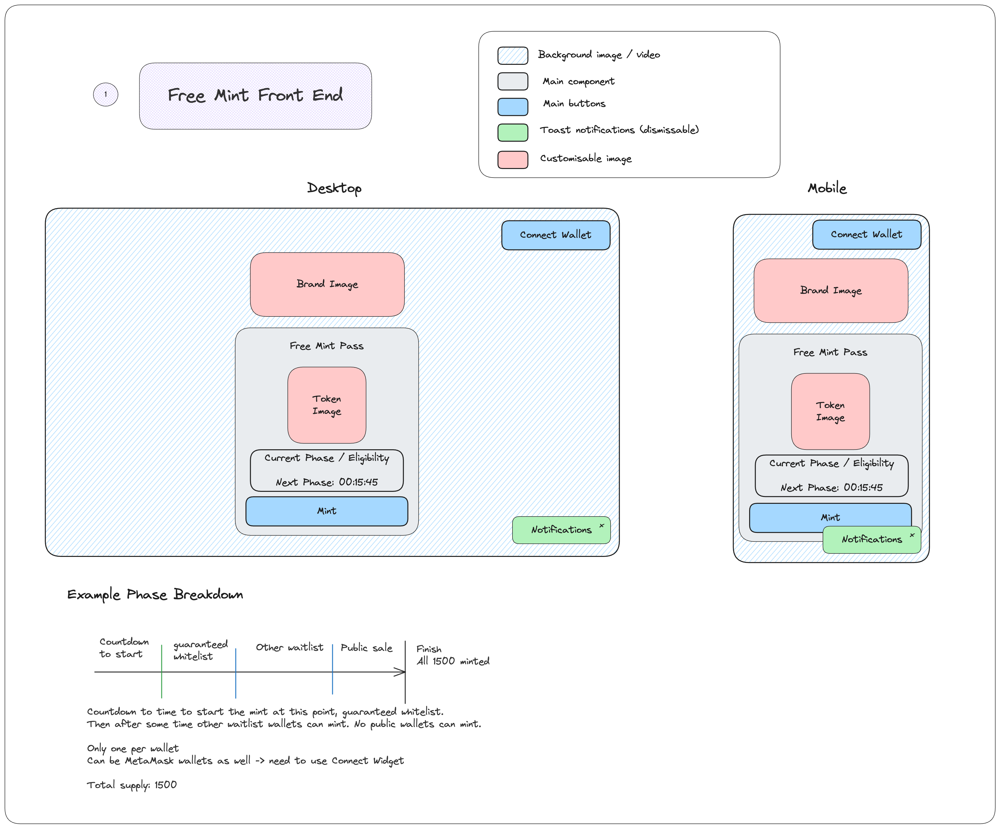

# Immutable Free Mint Sample Frontend

This code example shows how to conduct a free mint using a frontend website with the free mint backend tooling example code.
The front end code uses Immutable Passport and Immutable Checkout - Connect Widget for connecting wallets to the dapp. The backend code will use Immutable's Minting API to provide gas-free minting of NFTs to your users.

This front end code is intended to be run with the minting-api-backend code found here: https://github.com/danekshea/minting-api-backend

## Diagram



## Get Started

Using Node v18+ and npm v10+, install the latest version of the @imtbl/sdk and then the rest of the dependencies.

```bash
npm i @imtbl/sdk && npm i
```

## Configuring the application

Before running the application there is some configuration that you will need to add:
1. Copy the .env.example file and rename the copy to .env
2. Go to the [Immutable Hub](https://hub.immutable.com) and for your specific project select the environment that you want to use (sandbox - testnet or production - mainnet), and add the following to your .env file:
    1. Your publishable key from the API Keys section. Publishable key starts with `pk_`
    2. Create a Passport web client (if you haven't already) and get the Passport Client ID
    3. Set up a login redirect route for Passport (default for running locally is `http://localhost:5174/passport-redirect`)
    4. Set up a logoout redirect route for Passport (default for running locally is `http://localhost:5174/`)
3. Add the minting-api-backend base url to the .env file found from running the backend code. (default for running locally is `http://localhost:3000`).
4. Note: when running this against Immutable zkEVM Mainnet, you will need to create a Passport Client in the Hub for the production environment of your project and also set the VITE_IMMUTABLE_ENVIRONMENT variable to `production`


After starting the backend code, update the VITE_MINTING_BACKEND_API_BASE_URL to point to where your backend server is hosted.

## Run locally

`npm run dev`

## Passport login flow

After setting up your passport clientId and redirect variables, make sure that you have a route to handle the redirect. The component at this route should use the passport instance to call `loginCallback()`. See PassportRedirect component and how it is added to the React Router in main.tsx.

## Gotchas

In order to build for production, a package `jsbi` had to be installed to support one of the dependencies. The alias had to be added to the resovle section of the `vite.config.ts` file.

## Deployment in Vercel

A `vercel.json` file has been added to help configure for deployments in Vercel. This is not neccessary if you are not deploying to Vercel. It is re-writing all routes back to the index.html file to make the React Router work correctly.

## UI Kit: Chakra UI

- [Chakra UI Docs](https://v2.chakra-ui.com/)
- [Github](https://github.com/chakra-ui/chakra-ui)
- [Additional Examples](https://chakra-templates.vercel.app/)